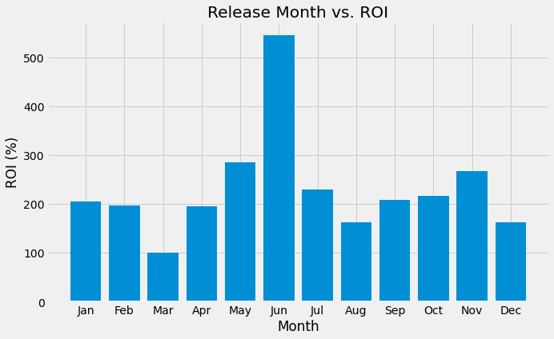

# Microsoft Studios Analytics

## Overview

Microsoft intends to add a movie studio division to its business portfolio. In doing so it needs insights into how it can maximize profit and minimize cost within this new division of its rather large company.

## Business Problem:

What insights can we provide to Microsoft to maximize chances of success in terms of profits (ROI) from its soon to be movie studio?

## Data:
My data was derived from https://www.imdb.com (IMDB = Internet Movie Database) and https://www.the-numbers.com and consisted of two csv's based on data from those websites.

## Methods:
I used descriptive statistics from 4 features from these dataframes. One feature consisted of Return on Investment, which I calculated as ROI = ((gross profit - production cost)/production cost) x 100).
These descriptive statistics led to choose to me compare ROI to release month, runtime and genre (of films).

## Analysis

Release Month vs. ROI

Runtime vs. ROI:

.png)

Genre vs. ROI

.png)

## Outcomes

- June is the best month to release a film. March is the worst month to release a film in terms of ROI. The remaining months show a similar range of ROI’s, though somewhat varied.
- After stratifying the data to examine the extremely high outliers (i.e., the top earners by ROI), a weak negative correlation may have been seen and the top earners/Blockbuster movies ranged in length from roughly 75 min to 135 min.
- The data within the genres column was problematic in that it had improperly assigned genres as well as an abundance of mixed genres that gave little insight. 
After heavy research by individual film and subsequent data cleaning, I was able to identify genres of the top 25 earning films (by ROI). 18 of those films were ‘Horror’ films and 2 were ‘Dramas.’ The remaining 5 films consisted of 1 each of the following: 'Drama,Romance', 'Action,Biography,Drama', 'Drama,Fantasy,Romance', 'Comedy,Drama', and ‘Drama,Thriller.'

## Conclusions
- In order to maximize ROI:
a) Aim to release films during June, while avoiding March.

b) Aim to release films of length between 75 and 135 min.

c) Aim to purchase scripts for horror and drama films.

## Next Steps

# For More Information

See the full analysis in the [Jupyter Notebook](./Jupyter_Notebook.ipynb) or review this [presentation](./Microsoft_Insights.pdf)

